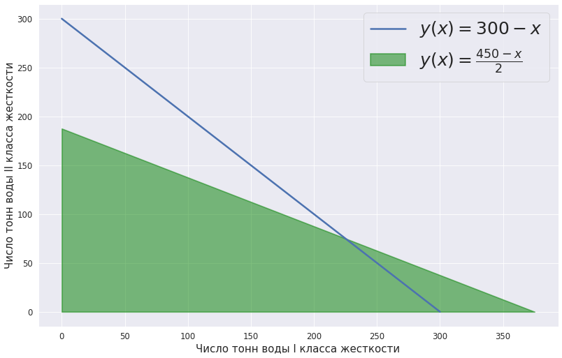

# Optimization Problem Solver

This repository demonstrates solving a linear programming problem with both `scipy.optimize.linprog` and a manual, from-scratch simplex tableau implementation, then compares the two.

**The problem:** blend two water sources of different hardness (Class I and Class II) so the total blend is exactly 300 tons (`x + y = 300`) and a second constraint `x + 2y <= 375` is satisfied, minimizing cost `8x + 6y`. See [`Simplex_method.ipynb`](Simplex_method.ipynb) for the full walkthrough with plots.

## Table of Contents
- [Introduction](#introduction)
- [Loading Libraries](#loading-libraries)
- [Building a Task Plot](#building-a-task-plot)
- [Implementation with SciPy](#implementation-with-scipy)
- [Result Images](#result-images)
- [Manual Implementation](#manual-implementation)
- [Result Images for Manual Implementation](#result-images-for-manual-implementation)
- [Tests](#tests)
- [Usage](#usage)

## Introduction

This repository provides a comprehensive solution for linear programming optimization problems using two methods:
1. **SciPy library**: A powerful and widely used library for scientific computing.
2. **Manual Simplex Method**: An algorithmic approach to solving linear programming problems.

The project includes code to set up the optimization problem, visualize it, and solve it using both methods.

## Loading Libraries

The code begins by installing required libraries and importing them for later use. The libraries include `scipy`, `icecream`, `seaborn`, `numpy`, `math`, `pandas`, and `matplotlib`.

```python
%pip install scipy icecream

import seaborn as sns
import numpy as np
import math
import pandas as pd
import matplotlib.pyplot as plt

from scipy.optimize import linprog
from icecream import ic
```

## Building a Task Plot

A plot is generated to visualize the optimization problem. This plot illustrates the constraints and objective function of the problem.



## Implementation with SciPy

The SciPy library is used to solve the linear programming problem. `linprog()` only solves minimization problems (not maximization) and does not allow `>=` inequality constraints -- both true of the formulation below, which is why the problem is set up as a minimization with one equality and one `<=` constraint.

```python
obj = [8, 6]

left_side_ineq = [[1, 2]]
right_side_ineq = [375]

left_side_eq = [[1, 1]]
right_side_eq = [300]

bnd = [(0, float("inf")),
       (0, float("inf"))]

opt_ans = linprog(c=obj, A_ub=left_side_ineq, b_ub=right_side_ineq,
                  A_eq=left_side_eq, b_eq=right_side_eq, bounds=bnd,
                  method="revised simplex")

opt_ans
```

This gives `x = 225`, `y = 75`, objective value `2250`.

## Result Images

After obtaining the solution with SciPy, the code generates a plot to visualize the constraints, objective function, and the optimal solution point.


## Manual Implementation

The code also provides a manual, from-scratch implementation of the simplex tableau method on the same problem, extracted into [`simplex_solver.py`](simplex_solver.py) so it's importable outside the notebook. It reaches the same answer as SciPy on this problem (`x = 225`, `y = 75`) -- see [Tests](#tests).

```python
from simplex_solver import simplex

c = [8.0, 6.0, 0.0]
A = [[1.0, 1.0, 0.0],
     [1.0, 2.0, 0.0]]
b = [300.0, 375.0]

x, y, _ = simplex(c, A, b)
```

Note this isn't a general-purpose LP solver: the caller has to already know how many tableau columns are needed and pad `c`/`A` accordingly (as above), and it has only been verified against this one problem.

## Result Images for Manual Implementation

Finally, the code generates a plot to visualize the constraints, objective function, and the optimal solution point obtained through the manual implementation of the simplex method.


## Tests

`tests/test_simplex_vs_scipy.py` checks the manual implementation's answer against `scipy.optimize.linprog` on this repo's reference problem. Run with:

```bash
pip install -r requirements.txt pytest
PYTHONPATH=. pytest tests/
```

## Usage

1. **Clone the repository**:
   ```bash
   git clone https://github.com/denis-samatov/simplex_method.git
   cd simplex_method
   ```
2. **Install dependencies**:
   ```bash
   pip install -r requirements.txt
   ```
